# Library Management System

Hello! Welcome to my repository. This project was built as part of [Frappe's Dev Hiring Test](https://frappe.io/dev-hiring-test). As outlined in their assignment, this is a Library Management System which supports:
- Basic [CRUD](https://developer.mozilla.org/en-US/docs/Glossary/CRUD) operations on Books and Members.
- Issuing books to members
- Returning books from members
- Charging rent on return.
- Ensuring the debt does not go above Rs. 500.

Additionally, a librarian is able to maintain:
- Books
- Members
- Transactions
- Reports on popular books and highest paying members

The application is compatible with Frappe's API, which is used for importing Books. 

## How to use?

- Install the dependencies:

```
npm install
```

- Install MongoDB and run it by following the instructions on their [docs](https://docs.mongodb.com/manual/administration/install-community/).

- Start the server:
```
npm run dev
```
- Open `localhost:5000` in your browser.

## Tech Stack:


## Screenshots:

### Home Page:

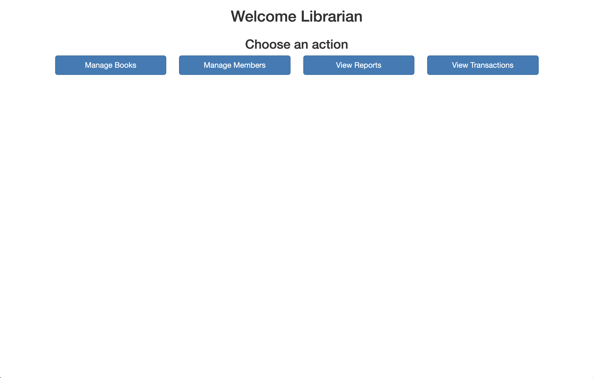

### Manage Books:

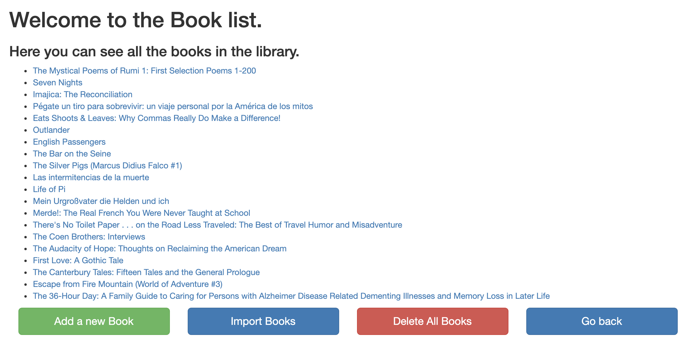

### Book Details:


### Edit a Book:

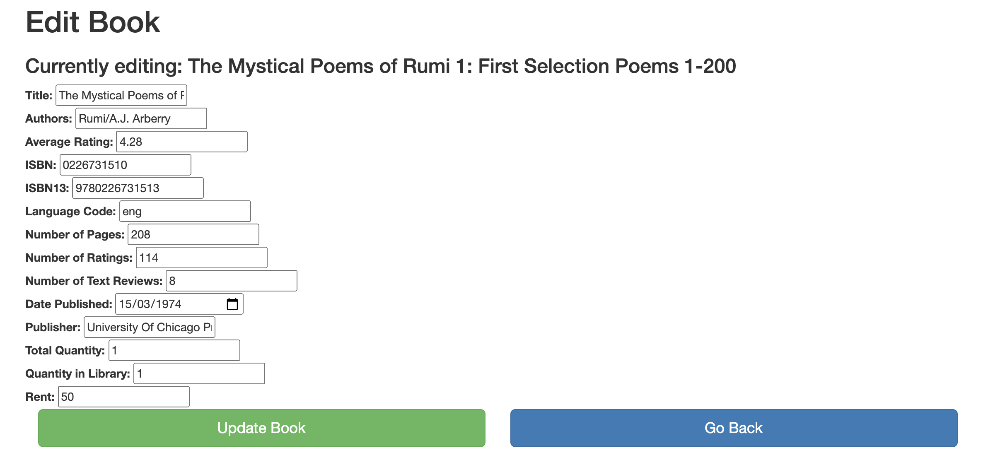

### Import Books:

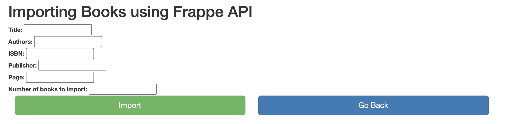

### Manage Members:

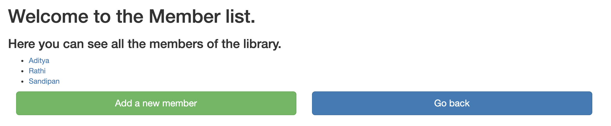

### Member Details:

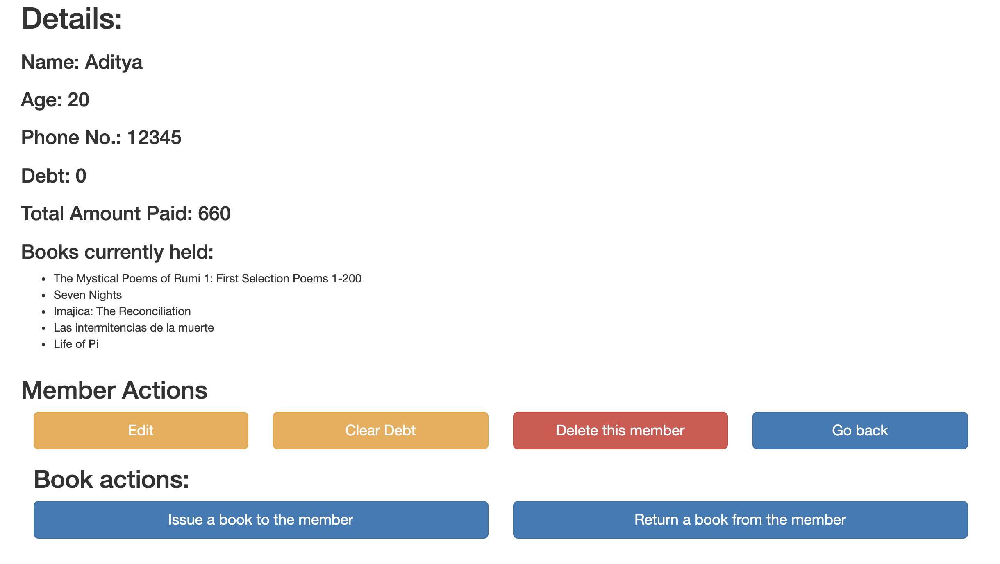

### Issue Books:


### Issue Books(with debt exceeded):

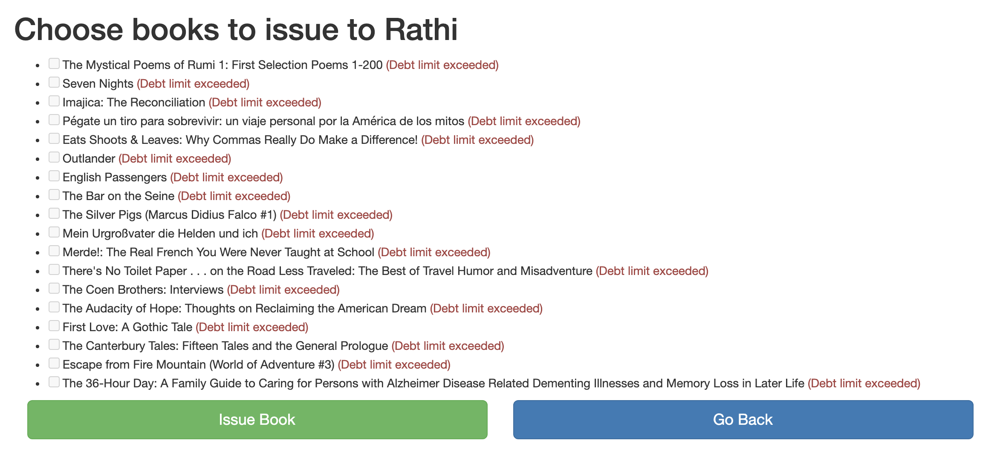

### Return Books:

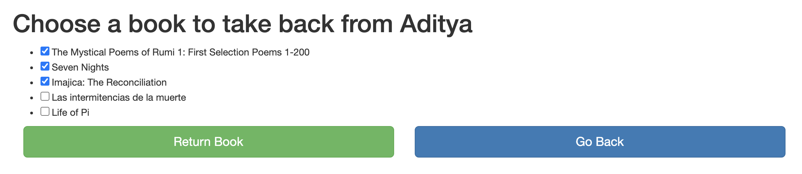

### Updated Member with debt:

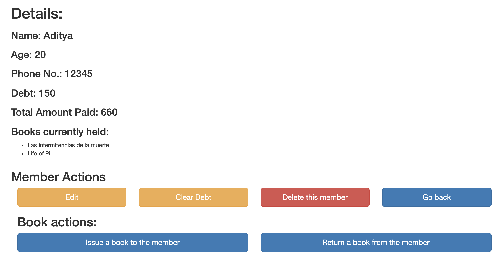

### Clearing Debt:

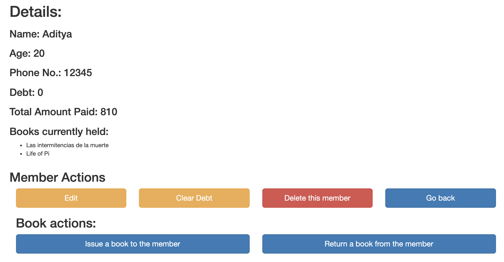


### Transaction Details:

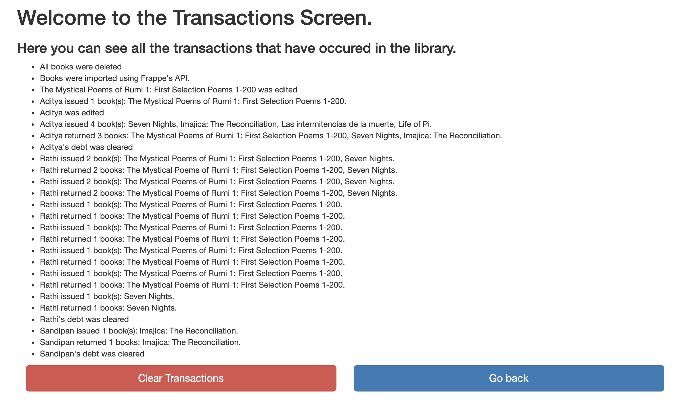

### Reports:

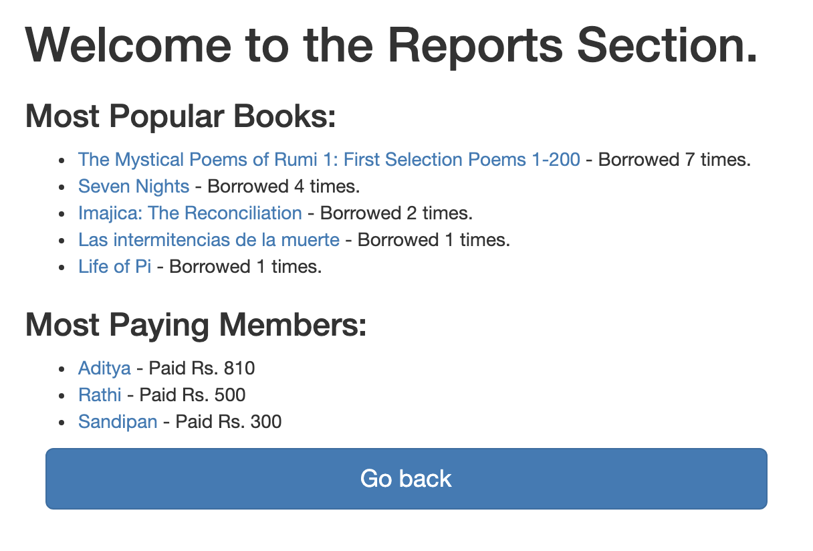